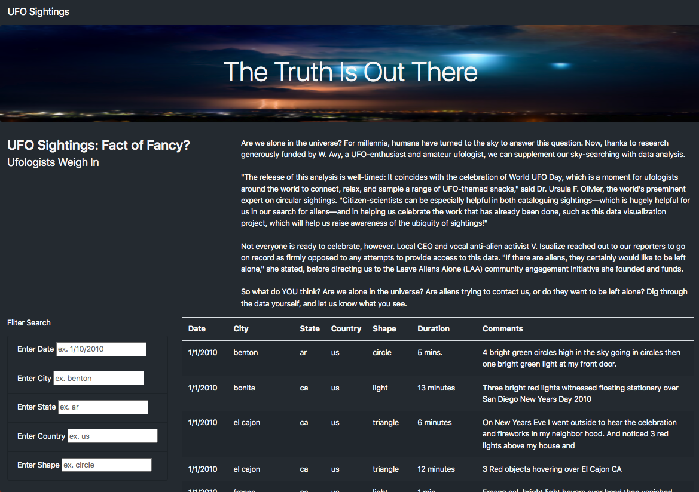

# UFO Sightings 
## Project Overview
For this analysis, we will create a clean webpage that contains an interactive table of recorded UFO sighting data. *Javascript* will be used to design the stucture of the table and Bootstrap elements allow users to interface with the website and filter the data by the criteria of their choosing. 

## Results
The webpage contains an excerpt at the top that sheds light on the purpose of the website and that data displayed. The website serves as a tool for those looking to form an opinion of their own: Are UFO sightings true events? 

The table contains UFO sighting data with the following information: date, city, state, country, shape, duration, and comments from the viewer. You can then filter the data in the table by the following criteria: date, city, state, country, and shape. 

Let's say I was from California and wanted to join the conversation about UFO sighting conspiracy. I would visit this webpage and filter the table to show all sightings within California, USA. 
Then maybe I would want to know about sightings within the past year, which i could also filter. And I could then continue to narrow the search by filtering cities within California and the "shape" of the UFO that was recorded. 

## Summary 
Overall, it is a user friendly webpage that allows users to interact with the data to find the exact records they are seeking. However, one drawback to our table is case sensitivity. This may pose a challenge for some users because all the data within the table in lowercase, meaning that is all Javascript can recieve. For example, a user looking for all sightings in Arizona, "AZ" would return an empty table; whereas a user who enters "az" will be satisfied with the output. 

To further enhance the user experience, I would recommend including a dropdown menu for each of the filter criteria. For example, the shapes column contains 7 different options, one being "light". Not every user will be a UFO expert and may not know that light is considered a shape when classifying UFO sightings. It would be helpful for the user to see what their options are and they can proceed from there.  
